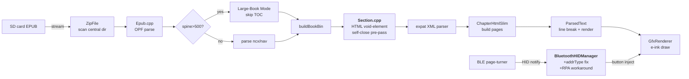

<h1 align="center">ruru-reader-tw</h1>

<p align="center"><strong>Traditional Chinese firmware for the YueXingTong X4 e-reader.</strong><br>
jf-openhuninn rounded font · full Bluetooth fixes · large-EPUB support · bookmarks</p>

<p align="center">
  
  
  
  
  <a href="https://github.com/HelloRuru/ruru-reader-tw/releases/latest"></a>
</p>

<p align="center">
  <b>English</b> | <a href="README.zh-TW.md">繁體中文</a>
</p>

<p align="center">
  <a href="#package-30-second-quick-start">Quick Start</a> ·
  <a href="#brain-features">Features</a> ·
  <a href="#wrench-verified-hardware">Hardware</a> ·
  <a href="#open_file_folder-architecture">Architecture</a> ·
  <a href="#bulb-design-rationale">Design</a> ·
  <a href="#world_map-roadmap">Roadmap</a>
</p>

<p align="center">
<pre>
  ┌─────────────────────────┐
  │  ╔══════════════════╗   │
  │  ║                  ║   │       jf-openhuninn rounded
  │  ║   Recent books   ║   │       full punctuation
  │  ║                  ║   │       3×3 grid · bookmarks
  │  ║   [3×3 covers]   ║   │       large-book ready
  │  ║                  ║   │
  │  ╚══════════════════╝   │
  │                         │
  │   ◀  ●●  ▶              │       YueXingTong X4
  └─────────────────────────┘       (ESP32-C3, 320KB RAM)
</pre>
</p>

---

## :package: 30-second Quick Start

> **TL;DR**: open the web flasher in Chrome, plug in the X4 via USB-C, pick a `.bin`, click flash.

1. Download a firmware from [Releases](https://github.com/HelloRuru/ruru-reader-tw/releases/latest):
   - `ruru-reader-tw-stage12.6-*.bin` — Traditional Chinese (recommended for TC readers)
   - `ruru-reader-cn-stage12.5-*.bin` — Simplified Chinese
2. Open <https://xteink.dve.al/> in **Chrome** (WebSerial required).
3. USB-C cable to the X4, click **Connect**, select your downloaded `.bin`, click **Flash**.
4. After reboot: `Settings → Bluetooth → Enable Bluetooth → Scan` and pick your page-turner.

That's it. Subsequent boots auto-reconnect to your page-turner.

> :information_source: When upgrading firmware later, consider deleting `.crosspoint/` on the SD card to clear stale chapter caches. User settings (BT state, font, margins) are preserved.

<details>
<summary><b>Advanced: flash via ESPTool CLI</b></summary>

```bash
esptool.py --chip esp32c3 --port /dev/ttyUSB0 --baud 921600 \
  write_flash -z 0x10000 ruru-reader-tw-stage12.6-20260505.bin
```

Replace the port (`/dev/ttyUSB0` on Linux, `COM3` on Windows, `/dev/cu.usbmodem*` on macOS).

</details>

---

## :brain: Features

The **YueXingTong X4** (閱星曈 X4) is an ESP32-C3 e-reader with 320KB RAM, 16MB flash, no PSRAM. Stock firmware (ChineseType) is built for Simplified Chinese users and bundles services that Traditional Chinese readers don't need.

This fork makes the X4 a great reader for **Traditional Chinese users**:

- :sparkles: **jf-openhuninn rounded font** with full punctuation, digits, and Latin glyphs (11288 chars)
- :wrench: **Four upstream Bluetooth crash bugs fixed** (RPA mishandling, vector-of-raw-pointers race, double-free on disconnect, blocking scan)
- :detective: **NimBLE `getAddressType()` workaround** — RPA addresses were misreported as PUBLIC, causing 30s connect timeouts
- :books: **Large-EPUB support** — books up to 15MB and 2752+ chapters now open
- :anchor: **HTML void-element self-close pre-pass** — fixes the dreaded "tap chapter TOC and the reader freezes" bug on web novels
- :bookmark: **Bookmarking system** with spine-aligned jump-to-bookmark
- :art: **3×3 home grid** with cover art and progress bars
- :globe_with_meridians: **Auto Simplified→Traditional conversion** via OpenCC `s2twp`

---

## :wrench: Verified hardware

### Bluetooth page-turners

| Device       | Connect             | Page-turn                                | Notes                                                                    |
| :----------- | :------------------ | :--------------------------------------- | :----------------------------------------------------------------------- |
| iDal-10822   | :white_check_mark:  | :white_check_mark: keycode `0x4E`        | Daily driver                                                             |
| E1 Control   | :white_check_mark:  | :white_check_mark: keycode `0x4B`        | Backup                                                                   |
| HBTR003-XT   | :x:                 | —                                        | RPA instability (NimBLE / hardware limitation, not fixable in firmware)  |

### Large EPUB compatibility

| Book                                 | Size      | Spine items | Open                | Page-turn           | Tap TOC             |
| :----------------------------------- | :-------- | :---------- | :------------------ | :------------------ | :------------------ |
| Web novel (no chapter index)         | 15 MB     | —           | :white_check_mark:  | :white_check_mark:  | :white_check_mark:  |
| Multi-chapter web novel              | 10.25 MB  | 2752        | :white_check_mark:  | :white_check_mark:  | :white_check_mark:  |

---

## :open_file_folder: Architecture

Below is the data flow from a tapped EPUB to a rendered page. Modules in **bold** are the files we touched the most:



### Project layout

```text
ruru-reader-tw/
├── lib/
│   ├── Epub/
│   │   └── Epub/Section.cpp     # HTML void-element self-close (the big fix)
│   ├── hal/
│   │   └── BluetoothHIDManager  # 4-way BT fix + RPA workaround + reconnect
│   └── PngToBmpConverter/       # streaming PNG decoder (no OOM on big covers)
├── src/
│   ├── activities/
│   │   ├── home/                # 3x3 grid recent books
│   │   ├── reader/              # EpubReader, BookmarkActivity
│   │   └── settings/            # BluetoothSettings (with _uiBluetoothActive flag)
│   └── components/icons/        # 12 new icons for grid view
├── scripts/
│   └── charsets/charset_full.txt  # 11288-char font subset (with punctuation)
└── release/                     # Pre-built BINs (gitignored, see Releases)
```

---

## :wrench: Customizing

| Want to change              | Look at                                                                          |
| :-------------------------- | :------------------------------------------------------------------------------- |
| Font subset                 | `scripts/charsets/charset_full.txt` + run `lib/EpdFont/scripts/fontconvert.py`   |
| Bluetooth keycodes          | `lib/hal/DeviceProfiles.cpp` (per-device profile)                                |
| Reader menu items           | `src/activities/reader/EpubReaderMenuActivity.h`                                 |
| Default theme               | `src/CrossPointSettings.h` `uiTheme` initializer                                 |
| Skip auto-reconnect window  | `BluetoothHIDManager::_uiBluetoothActive` flag                                   |

---

## :bulb: Design rationale

**Why fork at all?** Upstream ChineseType has the BLE manager UI commented out and bookshelf list-only — these are signals the upstream author knows there are issues but worked around them. We chose to actually fix the underlying bugs:

1. **NimBLE address-type heuristic** — read MAC byte 0 bits 7:6 instead of trusting `getAddressType()`. RPA addresses (`01`) become RANDOM, which the controller can actually find.
2. **HTML pre-pass over expat** — instead of swapping XML parsers (huge change), we run a 1024-byte buffered state machine that auto-closes void elements. Adds ~3KB flash, parses 100KB chapters in under 50ms.
3. **Bookmark spine+page** — store spine index + page count + progress percent; on jump, prefer spine when chapter count matches, fallback to percent. Survives layout reflow.
4. **3×3 grid** — shows 9 covers per page instead of 5 list items. Better information density on a 480×800 e-ink panel.

---

## :world_map: Roadmap

Things we might tackle next (no commitments):

- [ ] **stage8.4** — ZIP entry index persistence (faster second-time book opens)
- [ ] **Auto page-turn** — timer-based auto turn for hands-free reading
- [ ] **BT key mapping** — let users remap keycodes per page-turner
- [ ] **Real device screenshots** in this README
- [ ] **TXT reader improvements** (port from upstream master)

Open an [issue](https://github.com/HelloRuru/ruru-reader-tw/issues/new/choose) if you want to vote / request something.

---

## :speech_balloon: Community & support

- **Bugs**: [open an issue](https://github.com/HelloRuru/ruru-reader-tw/issues/new?template=bug_report.md) using the bug-report template
- **Feature ideas**: [feature request template](https://github.com/HelloRuru/ruru-reader-tw/issues/new?template=feature_request.md)
- **Security issues**: see [SECURITY.md](SECURITY.md) — please do **not** open public issues for security bugs
- **Contributing**: see [CONTRIBUTING.md](CONTRIBUTING.md)

---

## :pray: Acknowledgments

This project stands on the shoulders of:

| Upstream                                                                       | Author           | Contribution                                                       |
| :----------------------------------------------------------------------------- | :--------------- | :----------------------------------------------------------------- |
| [crosspoint-reader](https://github.com/daveallie/crosspoint-reader)            | Dave Allie       | Original MIT-licensed reader                                       |
| CrossInk                                                                       | uxjulia          | Intermediate Chinese-friendly fork                                 |
| CrossInk-Carousel                                                              | chintanvajariya  | UI theme system (Lyra / Flow / 3Covers)                            |
| [crosspoint-chinesetype](https://github.com/icannotttt/crosspoint-chinesetype) | icannotttt       | Chinese localization, JianGuo cloud, KOReader sync, BLE skeleton   |

Font: [jf-openhuninn](https://justfont.com/huninn/) by **justfont** — CC BY 4.0.

Inspiration for the HTML self-close approach came from a parallel fork; implementation here is original.

---

## :scroll: Requirements & License

- **Hardware**: ESP32-C3 + 16MB flash + e-ink display (the X4)
- **Optional**: Bluetooth HID page-turner; SD card for books

Released under **MIT License** — see [LICENSE](LICENSE). Inherits MIT from the upstream chain. All modifications are also MIT.

---

<p align="center">
  <sub>Made by <a href="https://github.com/HelloRuru">HelloRuru</a> · 2026 · for Traditional Chinese readers</sub><br>
  <sub>:cherry_blossom: 給每一位想看繁體電子書的人 :cherry_blossom:</sub>
</p>
